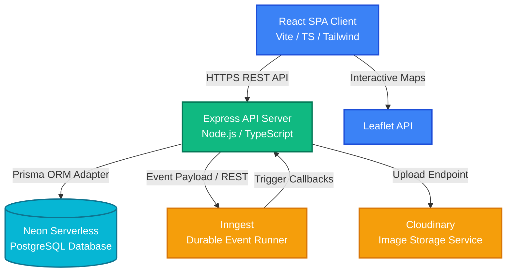

# 🛒 Grocery-Delivery: Full-Stack E-Commerce & Logistics Platform

[]()
[]()
[]()
[]()
[]()
[]()

A modern, high-performance, and beautifully designed full-stack e-commerce grocery delivery application. Featuring custom portals for **Customers**, **Delivery Partners**, and **Store Administrators**, the platform delivers end-to-end support from shopping and inventory control to automated workflow orchestration and live order tracking.

---

## 🏛️ System Architecture



---

## ✨ Key Features & Portals

### 👤 1. Customer Experience (Client Portal)
* **Interactive Shopping**: Dynamic search, filtering by category, and sorting options for a curated catalog of organic and standard products.
* **Smart Cart & Checkout**: Integrated checkout with custom delivery fee calculation, dynamic tax computations, and shipping address select.
* **Address Book**: Add and manage multiple addresses with default selection and precise coordinate-based mapping (`lat`, `lng`).
* **Live Order Tracking**: An interactive map visualizes real-time order movements, complete with an elegant step-by-step history timeline.

### 🚴 2. Delivery Partner Portal
* **Dedicated Authentication**: Custom authentication middleware specifically restricting access to registered delivery agents.
* **Delivery Dashboard**: Switch between active delivery runs and historical deliveries.
* **Logistics Pipeline**: Update order statuses (e.g., *Packed*, *Out for Delivery*), update live coordinate locations, and enter customer OTPs to securely verify and finalize deliveries.

### 👑 3. Administrator Portal (Admin Dashboard)
* **Real-time Analytics**: High-level store performance insights showing total revenue, order count, and system users.
* **Product Inventory System**: Full CRUD control over the products catalog with image uploads, category tags, organic status, pricing, and stock controls.
* **Order Orchestration**: Full view of customer orders with the ability to assign active delivery partners to pending orders.
* **Fleet Management**: Activation/deactivation of delivery partner accounts with approval settings.

### ⚙️ 4. Durable Event Processing (Inngest)
* **Event-Driven Workflows**: Orchestrates complex background tasks (e.g., post-checkout pipelines, async status hooks).
* **Local Developer Console**: Native Dev Server UI at `http://localhost:8288` to trigger, replay, or debug executing background jobs.

---

## 🛠️ Technology Stack

| Domain | Technologies |
| :--- | :--- |
| **Frontend** | React 19, TypeScript, Vite, Tailwind CSS v4, React Router v7, Leaflet (React Leaflet) for maps, Lucide React, React Hot Toast |
| **Backend** | Node.js, Express, TypeScript, tsx, nodemon |
| **Database & ORM** | Neon Serverless Postgres, Prisma ORM with `@prisma/adapter-neon` serverless WebSocket adapter |
| **Background Tasks** | Inngest (Durable functions SDK) |
| **Media Uploads** | Cloudinary CDN, Multer middleware |
| **Security & Auth** | JSON Web Tokens (JWT), Bcrypt password hashing, Cors, custom role-based auth middleware |
| **Deployment** | Vercel (Production environments) |

---

## 📂 Project Structure

```bash
Grocery-Delivery/
├── client/                     # Frontend Application (Vite + React)
│   ├── src/
│   │   ├── components/         # Reusable UI Components (Modals, ProtectedRoute)
│   │   ├── context/            # React Context API for global state management
│   │   ├── pages/              # Main App Pages (Home, Checkout, Tracking, etc.)
│   │   │   ├── admin/          # Admin Dashboard & Inventory pages
│   │   │   └── delivery/       # Delivery Partner pages
│   │   ├── types/              # TypeScript Type Declarations
│   │   ├── App.tsx             # Route Configuration
│   │   └── main.tsx            # Application Bootstrapper
│   └── vercel.json             # Vercel Client Deployment Routing Rule
├── server/                     # Backend API (Express + TypeScript)
│   ├── config/                 # Cloudinary, Nodemailer, and Prisma initializations
│   ├── controllers/            # Controller Logic (Auth, Address, Order, Products)
│   ├── inngest/                # Inngest Client setup and background function definitions
│   ├── middleware/             # Role-based request authentication (Customer, Admin, Partner)
│   ├── prisma/                 # Database Schema definitions
│   ├── routes/                 # Express API Endpoint Router groups
│   ├── types/                  # Express Request Type Extensions
│   ├── server.ts               # Server Entrypoint
│   └── vercel.json             # Vercel Serverless Server Deployment Settings
```

---

## 🚀 Getting Started

### 📋 Prerequisites
* Node.js (Latest LTS version recommended)
* A [Neon Database](https://neon.com/) account
* A [Cloudinary](https://cloudinary.com/) account

### 🔧 Installation & Setup

1. **Clone the repository:**
   ```bash
   git clone https://github.com/your-username/Grocery-Delivery.git
   cd Grocery-Delivery
   ```

2. **Configure Database Schema (Prisma):**
   Enter the `server` directory, create a `.env` file and define the connection strings:
   ```bash
   cd server
   ```
   Create a `.env` file:
   ```ini
   PORT=5000
   JWT_SECRET=your_jwt_secret_key
   
   # Connection strings from Neon console
   DATABASE_URL="postgresql://[user]:[password]@[endpoint]-pooler.[region].aws.neon.tech/[dbname]?sslmode=require"
   DIRECT_URL="postgresql://[user]:[password]@[endpoint].[region].aws.neon.tech/[dbname]?sslmode=require"
   
   # Cloudinary Keys
   CLOUDINARY_CLOUD_NAME=your_cloud_name
   CLOUDINARY_API_KEY=your_api_key
   CLOUDINARY_API_SECRET=your_api_secret
   ```

   Generate the Prisma Client and push the database schema:
   ```bash
   npx prisma generate
   npx prisma db push
   ```

3. **Install Dependencies & Start the Backend:**
   ```bash
   npm install
   npm run server
   ```
   The backend server will launch at `http://localhost:5000`.

4. **Install Dependencies & Start the Frontend:**
   Open a new terminal session, navigate to the `client` directory, and start the Vite dev server:
   ```bash
   cd client
   npm install
   npm run dev
   ```
   The frontend will launch at `http://localhost:5173`.

5. **Start Inngest Local Dev Server (Optional):**
   To support and trigger background event routines locally, run:
   ```bash
   npx --ignore-scripts=false inngest-cli@latest dev -u http://localhost:5000/api/inngest
   ```
   Open the Dev UI panel at `http://localhost:8288` to monitor executing workflows.

### 🔍 Troubleshooting & Build Verification

Before starting or deploying, verify compilation and run type checks:

* **Backend Type Checks & Compilation:**
  ```bash
  cd server
  # Verify no type compilation errors
  npx tsc --noEmit
  # Build typescript to js
  npm run build
  ```
  *(Note: A Stripe checkout session `line_items` schema syntax bug in `controllers/orderController.ts` and a type-safety check in `controllers/webhooks.ts` have been fixed).*

* **Frontend Type Checks & Build:**
  ```bash
  cd client
  # Run type compiler check
  npx tsc -p tsconfig.app.json --noEmit
  # Build application bundle
  npm run build
  ```

---

## 🔒 Security Practices

1. **Role-Based Authentication Access Control**:
   Three specialized middleware layers protect REST endpoints:
   * [auth.ts](file:///c:/Users/Lenovo/OneDrive/Desktop/Grocery-Delivery/server/middleware/auth.ts): Decodes user tokens and checks validity for consumer paths.
   * [admin.ts](file:///c:/Users/Lenovo/OneDrive/Desktop/Grocery-Delivery/server/middleware/admin.ts): Ensures request originates from a user with admin credentials.
   * [deliveryAuth.ts](file:///c:/Users/Lenovo/OneDrive/Desktop/Grocery-Delivery/server/middleware/deliveryAuth.ts): Validates active delivery agent credentials prior to serving requests.
2. **Secure Passwords**: All user passwords are encrypted using `bcrypt` before storage.
3. **CORS Configuration**: Restricts API calls to approved origins only.
4. **Environment Isolation**: Production tokens, connection strings, and media credentials are fully isolated inside secure environment variables.

---

## 🌐 Production Deployment

The project is pre-configured for deployment on **Vercel** for both client and server nodes:
* **Backend API Host**: [grocery-delivery-server-phi-orpin.vercel.app](https://grocery-delivery-server-phi-orpin.vercel.app)
* **Vercel Routing Configurations**:
  * Server deployed using the `@vercel/node` runner configured via [vercel.json](file:///c:/Users/Lenovo/OneDrive/Desktop/Grocery-Delivery/server/vercel.json).
  * React client SPA routing managed via URL rewrites in [vercel.json](file:///c:/Users/Lenovo/OneDrive/Desktop/Grocery-Delivery/client/vercel.json).
